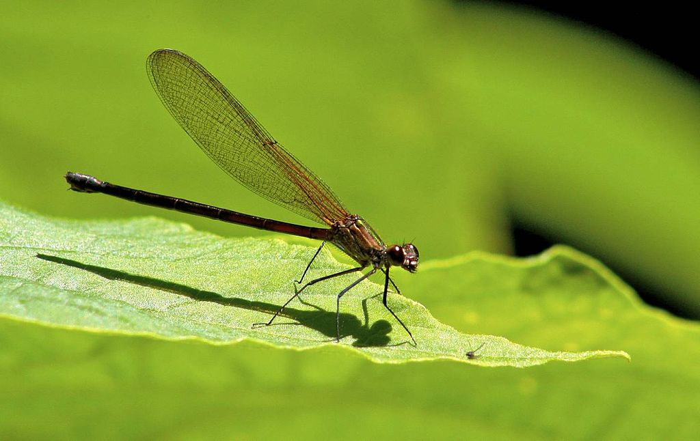

# Wings_Odonata_Database
Nous allons créer une base de données contenant des photos d'ailes de libellules.
## Introduction : 
#### Pourquoi les libellules sont fantastiques ?
Les libellules, fascinantes créatures ailées, appartiennent à l'ordre des odonates, un groupe d'insectes vieux de plusieurs millions d'années. Avec leurs ailes délicates et leurs couleurs éblouissantes, les libellules sont des insectes prédateurs aériens. Elles sont souvent considérées comme les joyaux de nos écosystèmes aquatiques, car elles passent la majorité de leur vie dans les milieux aquatiques à l'état de larves, où elles jouent un rôle essentiel en régulant les populations d'insectes nuisibles. Une fois adultes, elles prennent leur envol, parant nos étangs, rivières et zones humides de leur beauté éphémère. Leur capacité à chasser en plein vol et leurs incroyables migrations font des libellules des créatures captivantes de la nature.
#### Pourquoi etudier leurs ailes ? 
Les ailes des libellules sont de véritables chefs-d'œuvre de la nature. Elles sont transparentes et délicates, composées de membranes microscopiques tendues entre de fines nervures. Ces ailes permettent aux libellules de voler avec une agilité exceptionnelle, de chasser leurs proies en plein vol, et de parcourir de longues distances lors de leurs migrations. Les ailes des libellules peuvent également présenter une incroyable diversité de couleurs, de motifs et de textures, les rendant encore plus fascinantes pour les amateurs de nature et les chercheurs en entomologie. Ces ailes sont à la fois des outils de survie et de magnifiques œuvres d'art de la nature.
 
#### C'est jolie non ? 

 
